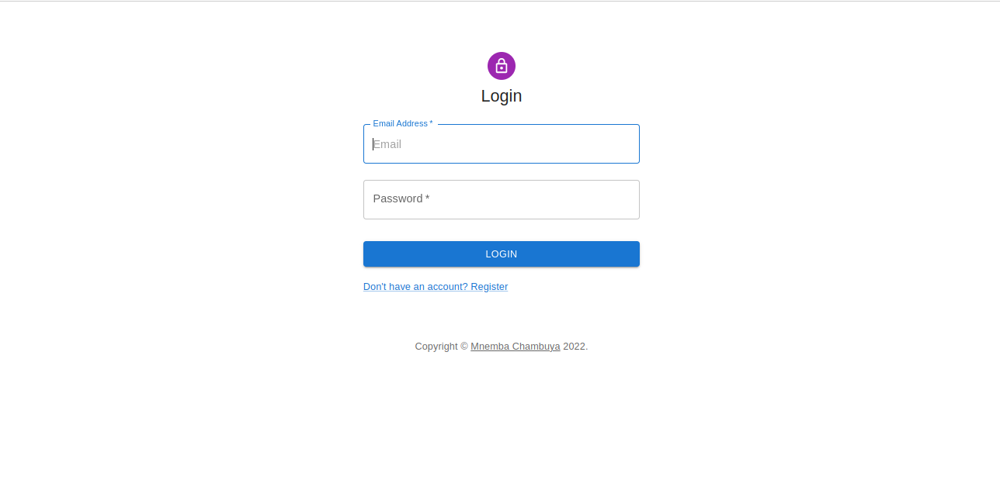

# Library Web

> Web app for front end of the library app.

## Screenshot 

## Live link http://23.239.16.175:3000/

## Built With

- React
- CSS, Tailwind, HMTL

To get a local copy up and running follow these simple example steps.

### Setup
1. git clone https://github.com/mnekx/library-web.git
2. cd library-web
3. npm install
4. npm start
5. Make sure the library-backend service is running
6. go to localhost:3000/register

## Tests
npm run tests
## Authors

👤 **Mnemba Chambuya**

- GitHub: [@mnekx](https://github.com/mnekx)
- Twitter: [@MnembaChambuya](https://twitter.com/MnembaChambuya)
- LinkedIn: [mnemba-chambuya](https://linkedin.com/in/mnemba-chambuya)

## 🤝 Contributing

Contributions, issues, and feature requests are welcome!

Feel free to check the [issues page](../../issues/).

## Show your support

Give a ⭐️ if you like this project!

## 📝 License

This project is [MIT](./LICENSE) licensed.

_NOTE: we recommend using the [MIT license](https://choosealicense.com/licenses/mit/) - you can set it up quickly by [using templates available on GitHub](https://docs.github.com/en/communities/setting-up-your-project-for-healthy-contributions/adding-a-license-to-a-repository). You can also use [any other license](https://choosealicense.com/licenses/) if you wish._
